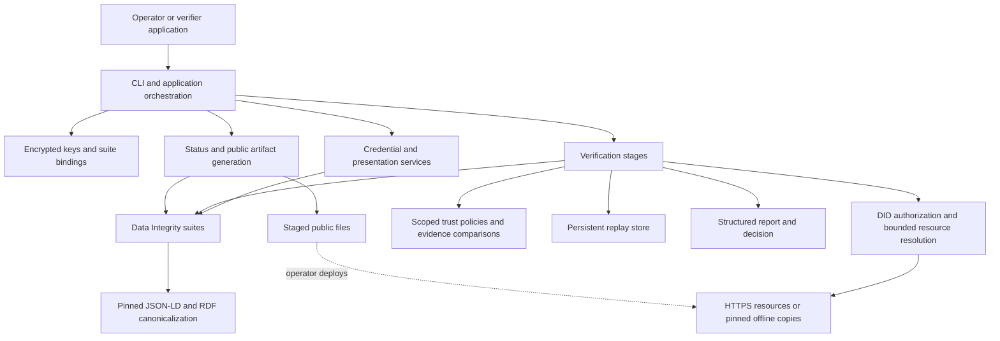
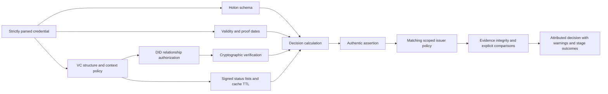
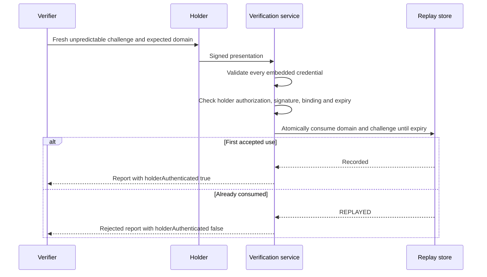

# Architecture

Holon VC is one Rust library (`holon_vc`) and one executable (`holon-vc`). The CLI
coordinates explicit application services; cryptographic operations, authorization,
trust policy, evidence assessment, and final decisions remain separate.

## System boundaries



The Rust executable does not call Python or Node for production cryptography.
Python runs the executable documentation and builds this site. Test-only JavaScript
provides an independent implementation for interoperability checks.

The issuer's static HTTPS server is outside the process. Generation stages files;
an operator deploys them. Optional OpenID metadata describes an externally operated
service, not an HTTP endpoint implemented by the CLI.

## Module responsibilities

Module names correspond to files under `src/`.

| Layer | Modules | Responsibility |
|---|---|---|
| Process boundary | `main`, `cli`, `app`, `config` | Clap command parsing, configuration precedence, operation dispatch, private directory lock, output and exit codes |
| Input model | `models`, `holon`, `schemas` | Duplicate-property rejection, typed Holon structures, semantic validation, pinned full/disclosure schema profiles |
| Identity and secrets | `keys`, `key_storage`, `public_keys`, `suites` | Key generation, encrypted envelopes, fingerprints, explicit key/controller/purpose/suite bindings |
| Cryptographic document processing | `jsonld`, `canonicalization`, `suites`, `disclosure` | Context policy, RDF expansion/canonicalization, proof signing/verification, actual statement derivation |
| Credential lifecycle | `credentials`, `status`, `presentations` | Issue, derive, reissue, manage status, package credentials, bind holder proofs, consume challenges |
| Resolution | `did`, `resolvers` | did:web translation, verification relationships, bounded HTTPS, digest pins and cache age |
| Decisions | `verification`, `trust`, `evidence`, `reports` | Independent checks, scoped authority, explicit comparisons, warnings, confidence and decisions |
| Public discovery | `well_known` | DID/linkage/JWKS/OpenID/Holon metadata generation, manifests and consistency validation |
| Persistence and failures | `storage`, `errors` | Descriptor-relative Linux files, atomic writes, permission checks, stable errors without document values |

Public functions in these modules form the library API. JSON-LD processing accepts
a loader interface. Presentation verification accepts a `ReplayStore` implementation;
the CLI supplies `SqliteReplay`. Direct library callers must arrange appropriate
serialization for mutating key, status, and publication operations.

## Credential issuance

1. Parse input with duplicate-property and size checks, then validate the typed Holon.
2. Select a schema ID and its full/disclosure profile. An optional `--schema` adds
   local validation; it does not replace the signed configured schema identity.
3. Load the suite and decrypt the key. Check algorithm, public fingerprint,
   controller, verification method, key status, and `assertionMethod` purpose.
4. Resolve the issuer's did:web document and require authorization of the same key.
5. Reject unapproved contexts, null values, and terms that would disappear during
   strict JSON-LD expansion. Build the unsigned VC with a new identifier.
6. Reserve entries in the issuer's private status registry and add both revocation
   and suspension references.
7. Sign using the selected real cryptosuite, then verify the result before output.

A failed issuance can leave an unused reserved status index. It is retained rather
than recycled into another credential's identity. Publishing an output is an atomic
file operation, not a transaction across every affected file.

## Verification pipeline



The diagram shows the logical stages, not parallel execution. Independent checks
are collected where safe; a stage that cannot run is marked `not-evaluated` rather
than treated as successful. An authorized DID key is not automatically trusted for
the Holon's claim type. Mandatory status failure is never interpreted as active.

Without a matching issuer policy, a credential that passes the required base checks
remains `authentic-assertion`. The first matching enabled policy in lexicographic
policy-ID order controls further requirements. Evidence must satisfy explicit
comparisons and configured organizational source groups to establish corroboration.
A digest match alone establishes integrity, not independent agreement.

## Cryptographic adapters and disclosure

| Suite | Key | Document processing | Application role |
|---|---|---|---|
| `eddsa-rdfc-2022` | Ed25519 | RDFC-1.0 and SHA-256 | Default credential, status, linkage and holder-authentication signing |
| `Ed25519Signature2020` | Ed25519 | URDNA2015 and SHA-256 | Legacy verification and explicitly opted-in issuance |
| `ecdsa-sd-2023` | P-256 | RDFC-1.0, HMAC labels, statement signatures and CBOR proof components | Base issuance, holder derivation and derived verification |

The modern adapters combine SSI JSON-LD selection/skolemization, Sophia canonical
label mappings, and established RustCrypto/ed25519-dalek primitives. Resource limits
cause rejection; there is no fallback to a weaker algorithm. Official vectors and
independent bidirectional interoperability tests exercise this composition.

ECDSA-SD issuance creates an ephemeral signing key and HMAC label material for the
base credential. Derivation first validates the base proof, selects the requested
statements plus mandatory metadata, constructs the derived proof, and verifies it.
It needs the base credential and public verification resources, not an issuer key.
Stable identifiers, dates and status entries remain correlatable.

Ed25519 redaction uses a different operation: the original issuer signs a new
credential with a new ID, a new status allocation, and a `reissuedFrom` link. It is
not reported as holder derivation. Full and disclosure schema variants retain the
same signed `HolonSubjectSchema` reference.

## Presentations and replay

An unsigned presentation transports already verified credentials and does not
authenticate a holder. A signed presentation adds a modern Ed25519
`authentication` proof binding the holder, expected challenge, domain, creation
time, and an expiry no more than five minutes later.



`SqliteReplay` uses an immediate transaction and a unique digest of the
(domain, challenge) pair. A reopened store continues to reject reuse; concurrent
consumers cannot both accept the same pair. The verifier must preserve replay state
and generate fresh challenges. Holder authentication does not imply that the holder
is the credential subject.

## Storage and publication

```text
DATA/
├── keys/private/          encrypted secret envelopes
├── keys/public/           public key metadata
├── suites/                explicit suite bindings
├── trust/                 local issuer policies
├── status/                private allocations and status registries
├── replay/                persistent challenge database
├── config/                TOML configuration and generated resource pins
└── site/                  intentionally public issuer artifacts
    ├── .well-known/       discovery, linkage, JWKS and manifest
    ├── departments/.../   path-based DID documents, when applicable
    └── status/            signed public status credentials
```

The documentation site built by Zensical goes to the separate repository directory
`site-docs/`; it does not contain the runtime `DATA` directory.

Private keys use Argon2id and XChaCha20-Poly1305 with authenticated metadata. Storage
opens path components without following symlinks and checks ownership/permissions.
Writes use temporary files, fsync, and rename. The CLI serializes its operations
with a private directory lock. These controls do not protect against a compromised
OS or another malicious process already running as the same user.

Public artifacts are written atomically per file, with the manifest committed last.
That detects mixed generations during verification but does not make publication or
rotation a single multi-file transaction. Deploy a complete versioned site directory
and switch the server's release pointer when snapshot availability is required.

## Network and configuration boundaries

The resolver checks HTTPS URLs, disables proxies/redirects/HTTP compression, checks
all resolved addresses, pins DNS results for connection establishment, and verifies
the connected address. DNS, connect, total request, and document-size limits bound
resource use. Development access requires both the explicit CLI mode and a configured
origin allowlist.

Pinned offline copies have content digests and expiries. Status pins additionally
have retrieval timestamps checked against the signed TTL. Contexts use a separate
local pinned loader; arbitrary network context loading and external schema references
are denied. A resource pin is not an issuer-trust policy.

Read [configuration](CONFIGURATION.md), [deployment](DEPLOYMENT.md),
[standards and limits](STANDARDS.md), and the [threat model](THREAT_MODEL.md) for the
operator-facing consequences. The [requirements map](REQUIREMENTS.md) identifies
corresponding acceptance tests.
